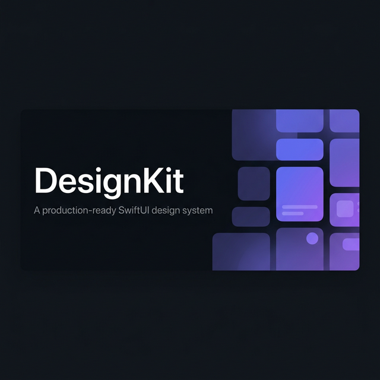

<p align="center">
  
</p>

<h1 align="center">DesignKit</h1>

<p align="center">
  A production-ready SwiftUI design system for iOS, macOS, tvOS, and watchOS.
</p>

<p align="center">
  
  
  
  
  
  
  
</p>

---

## Overview

DesignKit is a comprehensive SwiftUI design system built for teams who need **consistent, accessible, and themeable** UI components across all Apple platforms. It ships with 50+ components, a token-based design language, full RTL support, Dynamic Type scaling, macOS Catalyst compatibility, and a built-in component catalog for visual QA.

```swift
import DesignKit

// Themeable button with haptics and loading state
DKButton("Send Message", variant: .primary, isLoading: isSending) {
    await sendMessage()
}

// Growing text field — ideal for chat input
DKGrowingTextField(text: $message, placeholder: "Type a message…", maxLines: 5) {
    Image(systemName: "arrow.up.circle.fill")
        .foregroundColor(message.isEmpty ? .gray : .blue)
}
```

---

## Features

| | |
|---|---|
| Token System | Color, typography, spacing, shadow, radius, and animation tokens |
| Dark Mode | Every component adapts automatically via theme tokens |
| Accessibility | Full VoiceOver support, localized a11y labels, Reduce Motion respect |
| Localization | 10+ languages built-in, all strings override-able via `Localizable.strings` |
| RTL Support | `DKDirectionalHStack`, `.dkFlippedInRTL()`, `.dkLeadingPadding()` |
| Dynamic Type | `DKTypeScale`, `DKAdaptiveStack`, `.dkLimitDynamicType()` |
| Catalyst / macOS | `DKPlatform`, `.dkHoverEffect()`, `.dkCatalystWindowSize()` |
| Component Catalog | `DKComponentCatalog` — DEBUG-only browser for all 50+ components |
| Snapshot Tests | Visual regression suite via `swift-snapshot-testing` |
| iOS 16+ | Zero deprecated API usage, backward-compatible `@Observable` migration path |

---

## Installation

### Swift Package Manager

Add DesignKit to your `Package.swift`:

```swift
dependencies: [
    .package(url: "https://github.com/toprakdeviren/DesignKit.git", from: "2.0.0")
]
```

Or in Xcode: **File > Add Package Dependencies** and enter the repository URL.

Then import in your Swift files:

```swift
import DesignKit
```

---

## Quick Start

### 1. Apply the Theme

Wrap your root view with `.designKitTheme()` to inject the default theme:

```swift
@main
struct MyApp: App {
    var body: some Scene {
        WindowGroup {
            ContentView()
                .designKitTheme()      // default theme
                .dkToastOverlay()      // enables app-wide toast notifications
        }
    }
}
```

### 2. Use Components

```swift
// Buttons
DKButton("Primary",     variant: .primary)     { }
DKButton("Destructive", variant: .destructive) { }
DKButton("Loading",     variant: .primary, isLoading: true) { }

// Forms
DKTextField(label: "Email", placeholder: "you@example.com", text: $email,
            variant: .error, helperText: "Invalid address")

DKGrowingTextField(text: $message, placeholder: "Type here…", maxLines: 6) {
    // optional trailing button (send, attach, etc.)
}

DKSearchBar(text: $query, placeholder: "Search…")

// Feedback
DKActivityIndicator(style: .typing)
DKActivityIndicator(style: .processing, label: "Uploading…")

// Media
DKLazyImage(url: imageURL, transition: .fade())
    .frame(width: 200, height: 200)
    .cornerRadius(12)

DKMediaPreview(content: .link(url: url, title: "apple/swift", description: "…"), style: .card)

// Reactions
DKReactionPicker(items: $reactions, style: .bar)

// Toast
DKToastQueue.shared.show("Saved!", variant: .success)
DKToastQueue.shared.show("Undo delete?", variant: .warning,
    action: DKToastAction(title: "Undo") { restoreItem() })
```

### 3. Design Tokens

```swift
// Access tokens via the theme environment value
struct MyView: View {
    @Environment(\.designKitTheme) private var theme

    var body: some View {
        Text("Hello")
            .foregroundColor(theme.colorTokens.textPrimary)
            .padding(DesignTokens.Spacing.md.rawValue)
    }
}

// Animation tokens — prefer these over magic numbers
withAnimation(AnimationTokens.micro)      { isSelected.toggle() }
withAnimation(AnimationTokens.appear)     { isVisible = true }
withAnimation(AnimationTokens.transition) { tab = newTab }
```

### 4. State Management

```swift
// DKStateView handles loading / empty / error automatically
DKStateView(state: $viewModel.state, skeletonLayout: .list(rows: 4)) { items in
    ForEach(items) { item in ItemRow(item: item) }
}

// iOS 17+: @Observable migration path (backward-compatible with iOS 16)
@available(iOS 17, *)
let store = DKStateStore<[Message]>()

Task { await store.load { try await api.fetchMessages() } }
```

---

## Component Library

<details>
<summary><strong>Foundations</strong></summary>

| Component | Description |
|---|---|
| `DesignTokens` | Spacing, radius, shadow scale |
| `ColorTokens` | Semantic color palette (primary, neutral, semantic states) |
| `AnimationTokens` | `micro`, `appear`, `dismiss`, `transition`, `reveal`, `pop` |
| `DKTypeScale` | Semantic font levels with automatic Dynamic Type caps |
| `DKLocalizer` | String lookup with host-app override via `Localizable.strings` |

</details>

<details>
<summary><strong>Buttons & Controls</strong></summary>

| Component | Variants / Notes |
|---|---|
| `DKButton` | `.primary` `.secondary` `.destructive` `.link` — sizes `sm/md/lg` |
| `DKChip` | Removable tag chip with icon support |
| `DKChipGroup` | Multi-select chip collection |
| `DKRating` | Interactive star / custom-icon rating |
| `DKSwitch` | iOS-style toggle |
| `DKCheckbox` | Checkmark toggle with tri-state support |
| `DKRadio` | Single-select radio button |
| `DKSlider` | Range slider with step |
| `DKStepper` | Increment / decrement control |
| `DKSegmentedBar` | Segmented picker |

</details>

<details>
<summary><strong>Forms & Input</strong></summary>

| Component | Notes |
|---|---|
| `DKTextField` | Label, helper text, validation states, secure entry |
| `DKTextArea` | Multi-line, character counter |
| `DKGrowingTextField` | Auto-expanding — ideal for chat input |
| `DKSearchBar` | Cancel button, clear action |
| `DKDropdown` | Single-select drop-down menu |
| `DKDatePicker` | Native date picker wrapper |
| `DKTimePicker` | Native time picker wrapper |
| `DKDateRangePicker` | Start / end date pair |
| `DKColorPicker` | HSB color picker with presets |
| `DKFileUpload` | Drag & drop, format & size validation |

</details>

<details>
<summary><strong>Media & Content</strong></summary>

| Component | Notes |
|---|---|
| `DKLazyImage` | Async image with LRU cache, retry, shimmer, fade/scale transition |
| `DKMediaPreview` | `.image` `.video` `.audio` `.document` `.link` `.gif` × `.thumbnail/.card/.hero` |
| `DKActivityIndicator` | `.typing` `.processing` `.pulsing` `.streaming` |
| `DKReactionPicker` | Emoji/symbol/text reactions × `.bar/.popup/.inline` |
| `DKChart` | Bar, line, area, pie |
| `DKImageView` | Aspect-ratio aware image with content mode |

</details>

<details>
<summary><strong>Layout & Navigation</strong></summary>

| Component | Notes |
|---|---|
| `DKCard` | Surface card with optional header, shadow levels |
| `DKTabBar` | Bottom tab bar with badge support |
| `DKNavigationBar` | Custom navigation bar |
| `DKSidebar` | Split-view sidebar |
| `DKBreadcrumb` | Navigation trail |
| `DKAccordion` | Expand / collapse sections |
| `DKTimeline` | Vertical event timeline |
| `DKTable` | Columnar data table |

</details>

<details>
<summary><strong>Overlays & Feedback</strong></summary>

| Component | Notes |
|---|---|
| `DKModal` | Backdrop-dismissable modal |
| `DKBottomSheet` | Drag-to-dismiss bottom sheet |
| `DKToastQueue` | Non-blocking notification toasts |
| `DKContextMenu` | Long-press context actions |
| `DKTooltip` | Popover hint anchored to any view |
| `DKAlert` | Destructive / informational alert |
| `DKProgressBar` | Determinate & indeterminate |
| `DKSkeleton` | Content placeholder with shimmer |
| `DKStateView` | Loading / empty / error state machine |

</details>

<details>
<summary><strong>Interaction</strong></summary>

| Component | Notes |
|---|---|
| `DKSwipeableRow` | Leading / trailing swipe actions |
| `DKPullToRefresh` | Pull-to-refresh for `ScrollView` |
| `DKInfiniteScroll` | Automatic pagination trigger |

</details>

---

## Platform Support

```swift
// Detect platform at runtime
DKPlatform.isiOS      // true on iPhone/iPad (not Catalyst)
DKPlatform.isCatalyst // true on Mac Catalyst
DKPlatform.isMac      // true on native macOS

// Conditional visibility
Text("Touch-only hint").dkiOSOnly()
Text("Keyboard shortcut").dkMacOnly()

// Hover and pointer (no-op on iOS)
DKButton("Action", variant: .secondary) { }
    .dkHoverEffect(.highlight)
    .dkPointingCursor()

// Recommended Catalyst window size
ContentView()
    .dkCatalystWindowSize(minWidth: 700, minHeight: 500)
```

---

## Localization and RTL

DesignKit ships built-in strings for English, Turkish, Arabic, German, French, Spanish, Japanese, Korean, Chinese (Simplified), and Portuguese. It falls back to English when a key is missing.

Override any string by adding a `Localizable.strings` entry with the `dk.` prefix:

```
// Localizable.strings (tr)
"dk.button.send"         = "Gönder";
"dk.state.loading"       = "Yükleniyor…";
"dk.validation.required" = "Bu alan zorunludur";
```

RTL layouts work automatically when the device locale is right-to-left. For manual testing in Xcode Previews:

```swift
#Preview("Arabic RTL") {
    ChatView()
        .dkPreviewRTL()
}
```

---

## Dynamic Type

```swift
// Semantic fonts with automatic accessibility scaling caps
Text("Section Header").dkFont(.headline)   // caps at AX Extra Extra Large
Text("Timestamp").dkFont(.caption1)        // caps at AX Large

// Prevent a compact element from breaking at large sizes
DKBadge("99", variant: .danger)
    .dkLimitDynamicType(to: .accessibilityLarge)

// Adaptive layout: HStack at normal sizes, VStack at accessibility sizes
DKAdaptiveStack(spacing: 12) {
    avatarView
    nameAndEmailStack
}
```

---

## Component Catalog

Add `DKComponentCatalog()` to your DEBUG build to get an interactive browser of all 50+ components, organized in 10 categories with live previews:

```swift
#if DEBUG
Button("Open Catalog") { showCatalog = true }
    .sheet(isPresented: $showCatalog) { DKComponentCatalog() }
#endif
```

---

## Project Structure

```
DesignKit/
├── Sources/
│   ├── DesignKit/
│   │   ├── Theme/              # Theme protocol and default implementation
│   │   ├── Tokens/             # Color, typography, spacing, animation, shadow tokens
│   │   ├── Layout/             # Container, Grid, Breakpoint, padding helpers
│   │   ├── Content/            # Typography modifiers, ImageView
│   │   ├── Components/         # 50+ SwiftUI components
│   │   ├── Utilities/          # Form validation, localization, toast queue,
│   │   │                       # view state, RTL, Dynamic Type, Catalyst compat,
│   │   │                       # deprecation, Observable migration
│   │   └── Tools/              # ComponentCatalog, TokenExporter, ThemePreview,
│   │                           # ComponentScaffold, PerformanceBenchmark
│   └── DesignKitMetal/         # Optional Metal GPU rendering for charts
│       ├── Renderers/
│       ├── Shaders/
│       └── Bridge/
├── Tests/DesignKitTests/       # Unit and snapshot tests
├── Examples/                   # Sample apps
├── Docs/                       # Documentation
├── RELEASE_CHECKLIST.md        # Pre-release verification checklist
├── CHANGELOG.md
├── CONTRIBUTING.md
└── Package.swift
```

---

## Development

```bash
# Build
swift build

# Test
swift test

# Makefile shortcuts
make build
make test
make lint      # requires SwiftLint  (brew install swiftlint)
make format    # requires SwiftFormat (brew install swiftformat)
```

To regenerate snapshot reference images, set `isRecording = true` in the test `setUp`, run the tests once, then revert the flag.

---

## API Stability

DesignKit follows [Semantic Versioning](https://semver.org). Public API is annotated with a stability tier:

| Tier | Meaning |
|---|---|
| `DKStable` | Safe for production — no breaking changes within a major version |
| `DKBeta` | API may change between minor versions with a deprecation notice |
| `DKExperimental` | May change or be removed in any release |

See [`RELEASE_CHECKLIST.md`](RELEASE_CHECKLIST.md) for the full pre-release process and [`CHANGELOG.md`](CHANGELOG.md) for version history.

---

## Contributing

Contributions are welcome. Please read [`CONTRIBUTING.md`](CONTRIBUTING.md) before opening a pull request.

- Bug reports and feature requests: [GitHub Issues](https://github.com/toprakdeviren/DesignKit/issues)
- Questions and discussion: [GitHub Discussions](https://github.com/toprakdeviren/DesignKit/discussions)
- Security vulnerabilities: see [`SECURITY.md`](SECURITY.md)

---

## License

MIT — see [`LICENSE`](LICENSE) for details.
